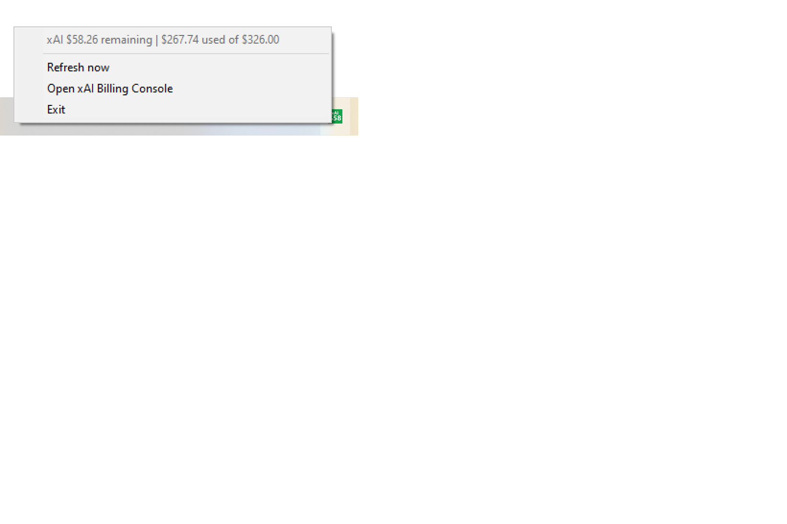

# xAI Remaining

xAI Remaining is a lightweight Windows tray app that shows your xAI team's remaining prepaid API credit.

It is xAI-only, intentionally small, and designed for local operator use. It does not track spending history, send telemetry, store secrets, or support other providers.

## Screenshot



## What It Does

- Runs as a Windows system tray app.
- Shows remaining xAI prepaid credit in the tray icon.
- Shows a short hover title such as `xAI $60.96 remaining`.
- Shows prepaid total, prepaid used/spent credit, and remaining credit in the right-click menu status when available.
- Refreshes automatically every 5 minutes.
- Keeps the last successful cached values visible during temporary API failures.
- Flashes a red `LOW` tray icon when remaining credit is at or below the configured threshold.
- Provides right-click menu actions for refresh, opening the xAI Billing Console, and exit.

Windows tray hover text is intentionally short; the right-click menu status is where the detailed total/used/remaining numbers appear.

The displayed credit is calculated as:

```text
remaining credit = prepaid total - prepaid used
```

Example:

```text
Prepaid Total: $326.00
Prepaid Used: $265.04
Remaining Credit: $60.96
```

## Requirements

- Windows.
- Python 3.12+ recommended for source runs.
- An xAI team ID.
- An xAI Management Key with billing read access.
- Python packages from [requirements.txt](requirements.txt): `pystray`, `Pillow`, and `requests`.

## Management Key vs API Key

`XAI_MGMT_KEY` must be an xAI Management Key. It is not the normal model/API key used for chat, completions, or inference.

xAI Remaining calls xAI Management API billing endpoints:

```text
GET https://management-api.x.ai/v1/billing/teams/{team_id}/prepaid/balance
GET https://management-api.x.ai/v1/billing/teams/{team_id}/postpaid/invoice/preview
```

The key must have access to the target team and billing data.

## Setup From Source

Clone the repo and enter the project folder:

```bat
git clone https://github.com/<your-account>/xai-remaining.git
cd xai-remaining
```

Create a virtual environment and install dependencies:

```bat
py -3 -m venv .venv
.venv\Scripts\python -m pip install --upgrade pip
.venv\Scripts\python -m pip install -r requirements.txt
```

Set the required environment variables:

```bat
setx XAI_MGMT_KEY "your-management-key"
setx XAI_TEAM_ID "your-team-id"
```

Open a new terminal after using `setx`, then run diagnostics:

```bat
py -3 xai_remaining.py --diagnose
```

Run the tray app from source:

```bat
py -3 xai_remaining.py
```

The diagnostic command does not start the tray and does not call xAI.

## Build EXE

Build a standalone Windows executable:

```bat
build_exe.bat
```

Output:

```text
dist\xAI Remaining.exe
```

Credentials are read from Windows environment variables at runtime. They are not baked into the executable.

## Rebuild And Run Workflow

For local operator testing:

```bat
rebuild_and_run.bat
```

This workflow stops old matching project processes, installs dependencies, runs `py_compile`, runs diagnostics, deletes a stale EXE, builds a fresh EXE, prints its timestamp, and launches it.

Preview the workflow without stopping processes, installing packages, building, launching, or calling xAI:

```bat
cmd /c rebuild_and_run.bat --dry-run
```

## Auto-Start On Boot

Build the EXE first so `dist\xAI Remaining.exe` exists.

1. Press `Win + R`.
2. Enter:

```text
shell:startup
```

3. Create a shortcut to:

```text
C:\Codex\xAI Remaining\dist\xAI Remaining.exe
```

Environment variables must be set with `setx` or through Windows user/system environment variables before auto-start will work.

## Configuration

Source runs read and create:

```text
config\settings.json
```

Packaged EXE runs read and create:

```text
dist\config\settings.json
```

Default settings:

```json
{
  "low_balance_alert_threshold_usd": 60.0,
  "flash_interval_seconds": 1.0
}
```

`low_balance_alert_threshold_usd` controls when the red `LOW` tray icon starts flashing.

`flash_interval_seconds` controls how often the tray icon alternates between the normal credit icon and the red `LOW` icon.

You can edit these settings without rebuilding. Do not put secrets in `config/settings.json`.

## Environment Variables

Required:

```text
XAI_MGMT_KEY
XAI_TEAM_ID
```

Optional parser overrides:

```text
XAI_PREPAID_TOTAL_FIELD_PATH=total.val
XAI_PREPAID_USED_FIELD_PATH=coreInvoice.prepaidCreditsUsed.val
```

Most users should leave the optional parser overrides unset. They are available for troubleshooting if xAI changes response field paths.

See [.env.example](.env.example) for a safe template. Do not put real values in files you commit.

## Debug Commands

Local diagnostics only. No tray, no xAI call:

```bat
py -3 xai_remaining.py --diagnose
```

One real refresh in the console. Does not start the tray loop:

```bat
py -3 xai_remaining.py --debug-once
```

Starts the tray normally and prints tray lifecycle messages:

```bat
py -3 xai_remaining.py --debug-tray
```

Calls the prepaid balance endpoint once and prints only safe numeric field candidates:

```bat
py -3 xai_remaining.py --debug-billing-fields
```

Calls the postpaid invoice preview endpoint once and prints only safe numeric field candidates:

```bat
py -3 xai_remaining.py --debug-usage-fields
```

The debug commands that call xAI never print secrets and do not dump full billing JSON.

## Cache Behavior

Runtime cache is written to:

```text
state\cache.json
```

For packaged EXE runs, cache is written beside the executable:

```text
dist\state\cache.json
```

The cache stores non-secret billing numbers only:

- `prepaid_total_usd`
- `prepaid_used_usd`
- `remaining_credit_usd`

The cache is runtime-only and ignored by git. If xAI is unreachable, the app keeps the last cached values when available and marks the status as a warning. Corrupt or old cache files are ignored safely.

## Troubleshooting

- Tray icon hidden: check the Windows tray overflow area behind `^`, then drag `xAI Remaining` into the visible tray if desired.
- Multiple running copies: run `rebuild_and_run.bat`; it stops old project EXE copies at `dist\xAI Remaining.exe` and only Python processes running this project's script.
- Wrong key type: use an xAI Management Key with billing read access, not a normal model/API key.
- Missing environment variables: set `XAI_MGMT_KEY` and `XAI_TEAM_ID`, then restart the terminal or app.
- `HTTP 401`: the management key is missing, invalid, expired, or copied incorrectly.
- `HTTP 403`: the management key does not have access to this team or billing endpoint.
- `HTTP 404`: `XAI_TEAM_ID` is likely wrong, or the key cannot access that team.
- Wrong balance fields: run `--debug-billing-fields` and `--debug-usage-fields`, then verify `XAI_PREPAID_TOTAL_FIELD_PATH` and `XAI_PREPAID_USED_FIELD_PATH`.
- Stale EXE: run `rebuild_and_run.bat`; it deletes `dist\xAI Remaining.exe` before building.
- Red `LOW` icon: remaining prepaid credit is at or below `low_balance_alert_threshold_usd`.
- Process runs but icon is not visible: run `py -3 xai_remaining.py --debug-tray` from a terminal and check the tray overflow area.

## Security

- Credentials are read only from environment variables.
- Secrets are never written to config files, cache files, diagnostics, or built artifacts.
- Diagnostics print only whether variables are set, never their values.
- Debug field commands print selected safe numeric candidates, not full billing payloads.
- Runtime cache stores non-secret billing numbers only.
- Keep Management Keys private and rotate them if exposed.

## License

MIT License. See [LICENSE](LICENSE).
